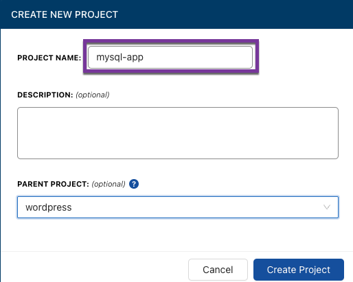

# Create A Project

In CloudTruth, think of a Project like your apps full-stack hierchy. In this section, we'll create the hierchy as:

- Project for the Kubernetes parameters/secrets/configuration data
- Project for the Terraform parameters/secrets/configuration data

## Top Level Project

Think of the Top Level Project as the parent object. The parent object should contain everything needed to make the full-stack work.

1. Log into your CloudTruth portal and click on the `Projects` button

2. Click the blue `Add Project` button

3. Give your parent project a name and click the blue `Create project` button. Because we're deploying a Wordpress app, it makes sense to call the parent project `Wordpress`.

## Terraform Projects

One of the really cool things in CloudTruth is you can create parent projects and have child projects underneath. It's great for a full-stack application that has multiple pieces. For example, a project that's deploying code to Kubernetes and needs a Kubernetes cluster created. Even though it's one project, it's still combining multiple pieces; application code and infrastructure code.

In this section, you'll create the child project for the Terraform code that'll be used to create the Kubernetes cluster.

1. Log into your CloudTruth portal and click on the `Projects` button

2. Click the blue `Add Project` button

3. Give your project a name and choose the parent project. In this case, it's `Wordpress`. Because this project is for Terraform code, we can call it `Terraform`.

Click the blue `Create project` button

## Kubernetes Projects

In this section, we'll do the same thing that we need in the **Terraform Projects** section, except we'll create two child projects.

The reason why is because later in the labs when we create the Kubernetes manifests for `mysql` and `wordpress`, we'll need to store the Kubernetes manifests as Templates in CloudTruth. To store the Templates, we'll need one Deployment spec (the Kubernetes manifest) per project.

1. Log into your CloudTruth portal and click on the `Projects` button

2. Click the blue `Add Project` button

3. Name your child project `wordpress-app` and ensure to select the `wordpress` parent project.

4. Create another child project and call it `mysql-app` and ensure to select the `wordpress` parent project

## End Result

Now that you have a parent project and two child projects, you should see the project hierchy similiar to the screenshot below.

